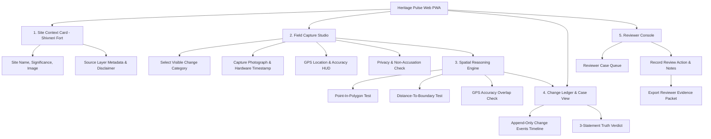
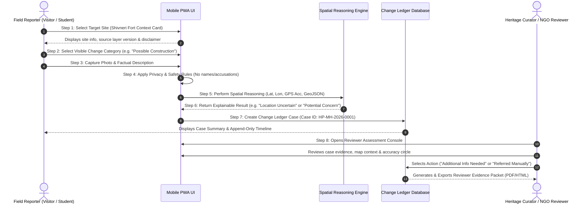
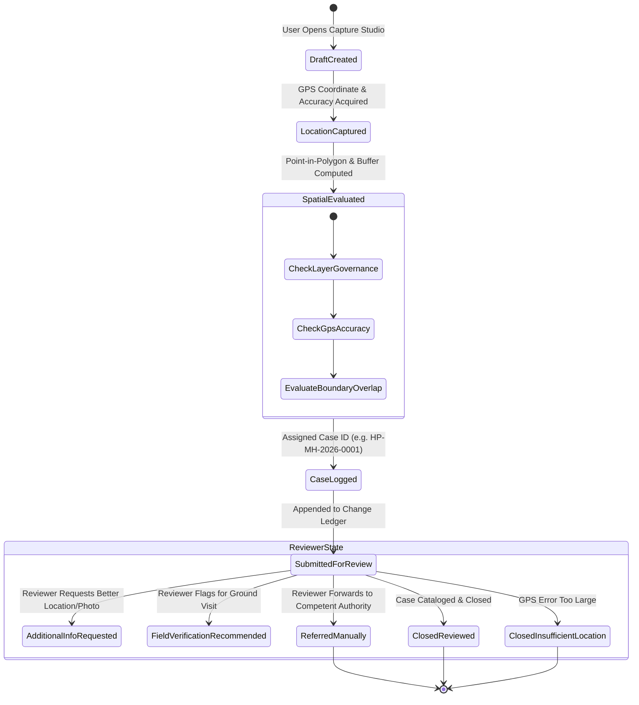

# APPLICATION FLOW & USER WORKFLOWS
## HERITAGE PULSE (हेरिटेज पल्स)
### Information Architecture, User Stories & State Machines
**Smart India Hackathon 2026 · Heritage & Culture · Problem Statement PS 26197**
*Team Sinister Six*

---

## 1. Information Architecture (IA)

---

## 2. Complete Step-by-Step User Workflow (Steps 1 – 8)

---

## 3. Change Ledger State Machine

---

## 4. End-to-End User Stories

### User Story 1: Field Visitor at Shivneri Fort
A student visiting Shivneri Fort notices newly dumped construction debris near the access pathway. They open Heritage Pulse, tap "Dumping or Waste", capture a photo, write a neutral description ("Debris pile noted 15m from lower pathway"), and allow GPS capture ($\pm 6.5\text{m}$). The app tests the point against the Shivneri source layer, generates Case `#HP-MH-2026-0012`, displays the spatial reasoning output, and adds the event to the Change Ledger.

### User Story 2: Reviewer Assessing an Ambiguous Case
A heritage NGO reviewer opens the Reviewer Console and selects Case `#HP-MH-2026-0014`. The report shows a point 5.0m from the boundary with a $\pm 12.0\text{m}$ GPS accuracy circle. The system displays: `Location uncertain – the GPS accuracy circle overlaps the zone boundary. The application cannot make a dependable zone classification.` The reviewer appends a note asking for a second field observation from a higher-precision device and updates the case status to `Additional Info Needed`.
