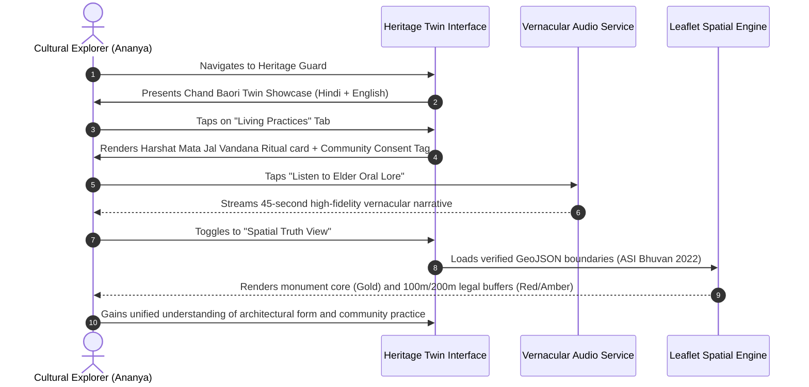
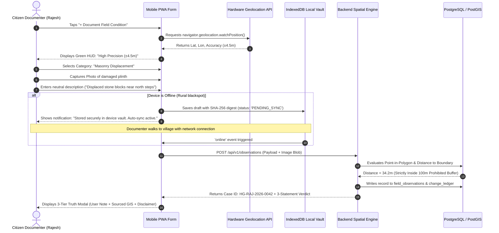
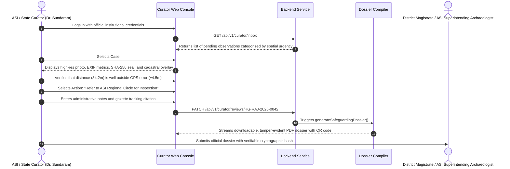
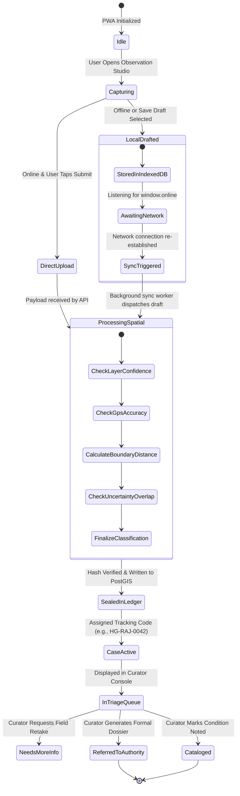

# APPLICATION FLOW & USER JOURNEYS
## HERITAGE GUARD (हेरिटेज गार्ड)
### Information Architecture, State Machines & End-to-End Workflows
**Smart India Hackathon 2026 · Heritage & Culture · Problem Statement PS 26197**
*Team Sinister Six*

---

## 1. Global Information Architecture (IA)

```mermaid
graph TD
    Root[Heritage Guard Root PWA]
    
    Root --> Hub[Heritage Twin Cluster Hub]
    Root --> CuratorAuth[Curator Portal Login]
    Root --> OfflineVault[Offline Cache Vault]

    Hub --> Layer1[Layer 1: Cultural Identity]
    Hub --> Layer2[Layer 2: Living Practices]
    Hub --> Layer3[Layer 3: Spatial Truth GIS]
    Hub --> Layer4[Layer 4: Field Observation Studio]
    Hub --> Layer4_Ledger[Layer 4: Temporal Change Ledger]

    Layer1 --> Vernacular[Vernacular Aliases & Sourced History]
    Layer1 --> OralAudio[Oral History Narrative Player]

    Layer2 --> CraftCards[Artisan Guild Cards]
    Layer2 --> RitualCal[Seasonal Ritual Timelines]
    Layer2 --> ConsentModal[Community Consent Badge & Attribution]

    Layer3 --> BoundaryOverlay[Monument + 100m Prohibited + 200m Regulated MultiPolygons]
    Layer3 --> SourceProvenance[Sourcing Agency, Date & Limitations]
    Layer3 --> TestScenarios[Jury Test Bench: 4 Pre-Seeded Scenarios]

    Layer4 --> NeutralForm[Neutral Observation Intake]
    Layer4 --> GpsTelemetry[Live GPS Sensor Accuracy HUD]
    Layer4 --> SHASealer[Client-side SHA-256 Checksum Engine]
    Layer4 --> SpatialVerdict[3-Statement Truth Modal]

    Layer4_Ledger --> TimelineFeed[Chronological Condition Log]
    Layer4_Ledger --> DiffSlider[Before/After Photo Comparison]

    CuratorAuth --> TriageInbox[Observation Triage Queue]
    TriageInbox --> DossierInspector[Evidence Dossier Inspector]
    DossierInspector --> ActionDispatch[Clarify / Catalog / Refer]
    ActionDispatch --> PdfGen[Standardized Institutional Safeguarding PDF]
```

---

## 2. End-to-End User Flow 1: The Cultural Explorer

---

## 3. End-to-End User Flow 2: Offline Field Observation & Spatial Reasoning

---

## 4. End-to-End User Flow 3: Curator Triage & Dossier Generation

---

## 5. Offline Sync Engine State Machine

