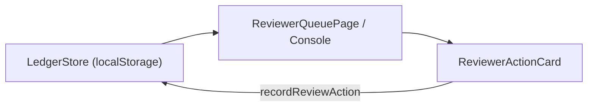

# A6 Reviewer Workflow & Review-Event Integrity Specification

**Heritage Pulse · SIH 2026 Prototype**  
**Monument**: Fort of Shivner (Shivneri Fort) [MUMMH015], Junnar, Pune District, Maharashtra  
**Milestone**: A6 (Reviewer Workflow & Review-Event Integrity)  
**Status**: COMPLETE & VERIFIED  

---

## 1. Executive Summary

The Heritage Pulse Reviewer Workflow provides an institutional triage and review interface for authorized conservation officers and curators. It enables human-in-the-loop validation of citizen field observations and spatial calculations, supporting structured decision-making without altering historical field records or recalculating spatial results.

Every reviewer decision generates an **immutable, append-only review event** in the Change Ledger, updates the case status, and persists immediately to the authoritative persistence boundary (`LedgerStore`).

---

## 2. Reviewer Interface & Queue Architecture

### 2.1 Route & Entry Points
- **Reviewer Queue (`/reviewer`)**: Searchable, filterable queue displaying all logged cases, telemetry, GPS error margins, spatial verdict, and current status.
- **Reviewer Console (`/reviewer-console`)**: Split-pane triage console allowing side-by-side inspection of telemetry, spatial findings, attached evidence, and decision controls.
- **Reviewer Action Card (`ReviewerActionCard.tsx`)**: Reusable component rendering institutional action options, justification textarea, safe language enforcement, and append-to-ledger actions.

### 2.2 Queue Data Flow

- **Zero Recalculation**: The queue and console consume stored values directly from `ObservationRecord` (`case.spatialResult`, `case.gpsAccuracyMeters`, `case.currentStatus`). No geometry math or Turf functions are invoked.

---

## 3. Supported Reviewer Actions & Status Transitions

The reviewer workflow supports six structured institutional actions, mapped to canonical `CaseStatus` states:

| Action Key | Action Label | Target Status | Event Type | Institutional Purpose |
|---|---|---|---|---|
| `REQUEST_ADDITIONAL_EVIDENCE` | Request Additional Evidence | `ADDITIONAL_INFORMATION_NEEDED` | `INFO_REQUESTED` | Solicits higher-precision GPS telemetry or alternate perspective photographs. |
| `RECOMMEND_FIELD_VERIFICATION` | Recommend Field Verification | `FIELD_VERIFICATION_RECOMMENDED` | `STATUS_UPDATED` | Dispatches an on-ground physical surveyor or designated ASI field team. |
| `REFER_OFFICIAL_REVIEW` | Refer for Official Review | `REFERRED` | `STATUS_UPDATED` | Compiles canonical evidence packet for forwarding to statutory authorities. |
| `CLOSE_NO_ACTION` | Close Case (Reviewed - No Action) | `CLOSED_REVIEWED` | `CASE_CLOSED` | Catalogs observation in Change Ledger with no further intervention required. |
| `CLOSE_DUPLICATE` | Close Case (Duplicate / Unrelated) | `CLOSED_DUPLICATE` | `CASE_CLOSED` | Marks observation as a duplicate or outside heritage protection scope. |
| `CLOSE_INSUFFICIENT_EVIDENCE` | Close Case (Insufficient Location) | `CLOSED_INSUFFICIENT_LOCATION_EVIDENCE` | `CASE_CLOSED` | Records observation closed due to wide GPS uncertainty disk (>35m or boundary overlap). |

---

## 4. Review-Event Integrity & Append-Only Guarantees

### 4.1 `ReviewEvent` Schema
Every decision appends a structured event object to `case.eventsTimeline`:
```typescript
interface ReviewEvent {
  eventId: string;             // UUID v4
  caseId: string;              // Owning case ID (e.g., HP-MH-2026-0001)
  timestamp: string;           // ISO 8601 string
  eventType: 
    | 'OBSERVATION_CREATED' 
    | 'LOCATION_CAPTURED' 
    | 'SPATIAL_CALCULATED' 
    | 'EVIDENCE_ATTACHED' 
    | 'REVIEW_ACTION_RECORDED';
  actorRole: string;           // e.g. "Heritage Curator", "Citizen Observer"
  summary: string;             // Neutral administrative summary
  actionTaken?: CaseStatus;    // Permitted target status
  reviewerNotes?: string;      // Reviewer justification
  resultingStatus: CaseStatus; // New case status
}
```

### 4.2 Immutability Guarantees
1. **Append-Only History**: `recordReviewAction` creates a shallow clone of `eventsTimeline` and appends the new event. Prior events are never mutated, reordered, or deleted.
2. **Monotonic Chronology**: Timestamps are strictly monotonic.
3. **Safe Rejection of Invalid Actions**: Any invalid status action (e.g. malformed or unrecognized status string) is rejected with `null`. Zero events are appended and the original case remains unchanged.
4. **Closed-Case Auditing**: If an authorized reviewer takes action on an already-closed case (e.g. reopening upon secondary report), an explicit subsequent review event is appended to the timeline, preserving the complete lifecycle history.

---

## 5. Safe Language Protocol Enforcement

All reviewer justification inputs are audited in real time against the Safe Language Protocol (`containsBannedLanguage`):
- Phrases claiming proven illegality, encroachment guilt, offender identification, or demolition orders are blocked before submission.
- Institutional, neutral terminology (e.g., *"Physical inspection recommended to assess zone proximity"*) is enforced.

---

## 6. Documented Limitations

1. **Simulated Roles**: The prototype simulates role contexts (`Heritage Curator`, `Chief Conservation Officer`, `Citizen Observer`) within a local browser session. Enterprise RBAC/SSO is not implemented in this prototype.
2. **Client-Durable Storage**: Review decisions are persisted to browser `localStorage` via `ClientStorageAdapter`. Multi-user concurrent synchronization requires a backend server.
3. **Single-Site Prototype**: Active prototype site is Fort of Shivner (`MUMMH015`).
