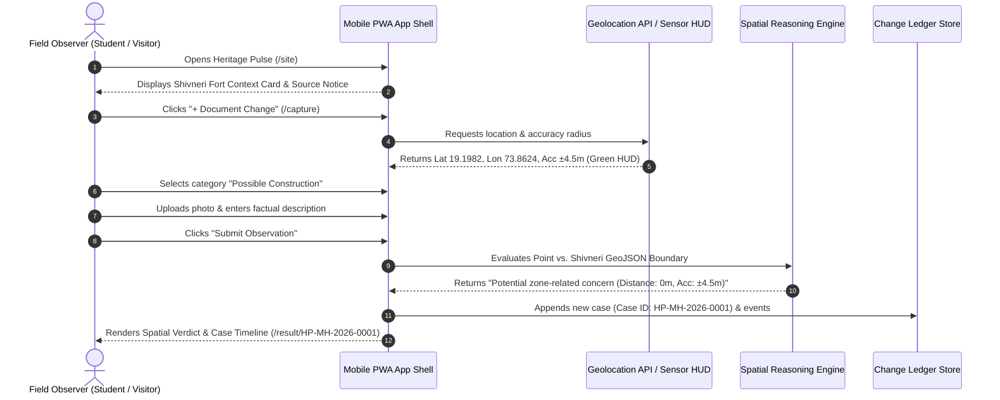
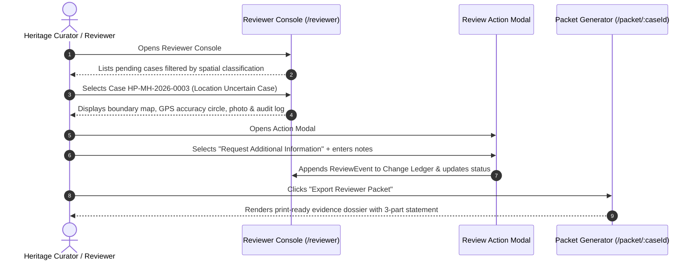

# USER FLOWS & INTERACTION JOURNEYS
## HERITAGE PULSE (हेरिटेज पल्स)
*Owner: Ameya | Reviewer: Vivek*

---

## 1. Flow 1: Field Observation Intake (Mobile Reporter)

---

## 2. Flow 2: Reviewer Triage & Evidence Packet Export (Curator)

